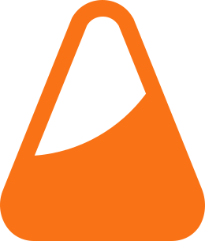

  
  <h1>IdeeLab</h1>
  
  

    <strong> Share and explore creative programming ideas on IdeeLab. </strong>  
    Discover inspiring project concepts, vote on your favorites, and spark your next build.
  

  
  

  
  
  
  
  
  

<h4>
    <a href="https://ideelab.cc">Website</a>
   · 
    <a href="https://docs.ideelab.cc">Documentation</a>
   · 
    <a href="https://github.com/An4s0/ideelab/issues/">Report Bug</a>
   · 
    <a href="https://github.com/An4s0/ideelab/issues/new?assignees=&labels=feature+request&template=feature_request.md&title=Feature+Request+%3A%20">Request Feature</a>
   · 
    <a href="https://github.com/An4s0/ideelab/discussions/">Discussions</a>
  </h4>

 
